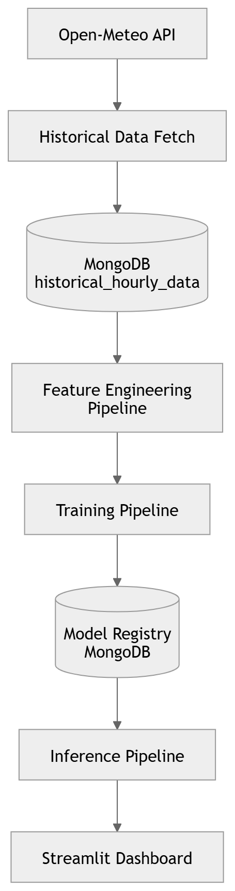

# 🌍 Karachi AQI Forecast System

### Production-Grade Multi-Horizon Air Quality Forecasting Platform

### 🔗 Live System

### 🔗 Live Streamlit Dashboard
https://10pearlsaqi-sjufhvkf5fs5tbumj4ztn4.streamlit.app/

### 🔗 Production Backend API (Railway)
https://web-production-382ce.up.railway.app

### 🚀 Project Overview

This is a production-grade, multi-horizon Air Quality Index (AQI) forecasting system built using modern MLOps principles.

The system:

Ingests 5 months of historical AQI data

Fetches live weather data via API

Performs Exploratory Data Analysis (EDA)

Engineers advanced time-series features

Trains multiple ML models per forecast horizon

Stores features in MongoDB Feature Store

Registers models in MongoDB Model Registry

Deploys best models via FastAPI

Serves predictions through a professional Streamlit dashboard

## 🔄 Data Pipeline

### 1️⃣ Data Ingestion

The system collects:

Historical AQI data (5 months)

Live weather data (temperature, humidity, wind speed, pressure)

Weather data is aligned with AQI timestamps to build a unified dataset.

### 2️⃣ Exploratory Data Analysis (EDA)

Before modeling, the system performs:

Distribution analysis

Correlation matrix between AQI & weather variables

Seasonal trend identification

Outlier detection

Missing value analysis

This ensures model robustness and interpretability.

### 3️⃣ Feature Engineering

Advanced time-series features are created:

Lag features (AQI t-1, t-24, t-48)

Rolling averages

Rolling standard deviation

Hour-of-day encoding

Day-of-week encoding

Weather interaction features

Multi-horizon targets (H1, H2, H3)

Engineered features are stored in MongoDB Atlas as a Feature Store.

---

## 📊 Exploratory Data Analysis (EDA)

Exploratory Data Analysis was conducted on 5 months of historical AQI and weather data (3,541 observations) to validate temporal behavior and engineered feature effectiveness prior to model training.

### 🔍 Dataset Summary
- 3,541 hourly observations
- 19 engineered features
- Multi-horizon targets (H1, H2, H3)
- Lag features (lag_1, lag_3, lag_6)
- Rolling statistics (roll_mean_6, roll_mean_12)
- Weather pollutants (NO₂, CO, SO₂, O₃)

---

### 📈 Key Findings

- AQI (PM2.5) shows moderate right-skewness with occasional pollution spikes.
- Strong temporal dependency observed through lag and rolling features.
- Nitrogen dioxide and carbon monoxide show moderate positive correlation with AQI.
- Ozone demonstrates a negative relationship with particulate concentration.
- Raw time features (hour, day, month) show weak linear correlation but contribute through nonlinear modeling.
- Multicollinearity exists among engineered temporal features but is manageable under tree-based ensemble models.
- The dataset is suitable for multi-horizon AQI forecasting.

---

### 📊 Visualizations Included

- AQI Distribution Histogram
- Hourly & Monthly Trend Analysis
- Correlation Heatmap
- Boxplot for Outlier Detection
- Scatter Plots (Pollutant vs AQI)
- Stationarity Discussion

---

### 📁 Files

- Notebook: `notebooks/EDA.ipynb`
- Dataset used for EDA: `eda_training_dataset.csv`

## 🏗️ System Architecture

The AQI Forecasting System follows a modular machine learning pipeline architecture integrating data ingestion, feature engineering, model training, model registry, and real-time inference.

### 🔄 Workflow Overview

1. Historical AQI & weather data fetched via Open-Meteo API  
2. Data stored in MongoDB (`historical_hourly_data`)
3. Feature engineering pipeline generates lag & rolling features
4. Multi-horizon models trained and stored in Model Registry
5. Best model selected automatically
6. Inference pipeline generates 1–3 day forecasts
7. Streamlit dashboard displays predictions

### 📊 Architecture Diagram

  

## 🔬 Methodology

### 1️⃣ Data Engineering

Historical hourly AQI dataset

### Feature engineering:

Lag features

Rolling averages

Time-based features

Stored in MongoDB Atlas (Feature Store)

### 2️⃣ Multi-Horizon Modeling Strategy

Instead of recursive forecasting, the system uses:

✔ Separate model per horizon
✔ Horizon-specific training
✔ Independent optimization

### Models trained:

Random Forest

Gradient Boosting

Ridge Regression

Each model trained independently for:

H1 → 24h

H2 → 48h

H3 → 72h

### 📊 Model Benchmark

Evaluation metric:

RMSE (Root Mean Squared Error)

| Horizon | Random Forest | Gradient Boosting | Ridge |
| ------- | ------------- | ----------------- | ----- |
| 24h     | 3.06          | 9.40              | 12.36 |
| 48h     | 2.67          | 9.35              | 13.36 |
| 72h     | 2.89          | 9.56              | 13.54 |

🏆 **Random Forest selected as production model

### 🧩 Backend – FastAPI (Production API)

### Endpoints

| Endpoint               | Description           |
| ---------------------- | --------------------- |
| `/`                    | Health check          |
| `/forecast`            | Multi-day forecast    |
| `/models/metrics`      | Model registry        |
| `/models/best`         | Best production model |
| `/features/importance` | Feature importance    |
| `/forecast/shap`       | SHAP explainability   |

### 🐳 Docker Deployment

Backend runs inside Docker on Railway:

FROM python:3.11-slim

WORKDIR /app

COPY . .

RUN pip install --upgrade pip
RUN pip install -r requirements_api.txt

CMD ["sh", "-c", "uvicorn app.main:app --host 0.0.0.0 --port ${PORT}"]

Railway dynamically injects the PORT environment variable.

### ☁️ Deployment Architecture

🚂 Backend → Railway

Dockerized FastAPI

MongoDB Atlas via environment variables

Auto-redeploy on GitHub push

🎈 Frontend → Streamlit Cloud

Connects to Railway API

Uses secrets manager for:

MongoDB URI

API URL

### 📊 Streamlit Dashboard Features

✔ Multi-day AQI gauge charts
✔ Forecast trend visualization
✔ Model benchmark comparison
✔ Feature importance visualization
✔ Executive summary
✔ Dark professional UI
✔ Retry & backend health handling

### 🔐 Environment Variables
Railway

MONGODB_URI=your_mongodb_connection_string

Streamlit Secrets

MONGODB_URI="..."
API_URL="https://web-production-382ce.up.railway.app"

### 🧠 Advanced Features

🧩 Advanced System Capabilities

Feature Store architecture (MongoDB)

Model Registry with best-model tagging

GridFS model persistence

Lazy model loading in production

SHAP explainability

Multi-model benchmarking

Dockerized deployment

Cloud-based scalable inference

### ⚙️ Tech Stack

Python 3.11

FastAPI

Streamlit

MongoDB Atlas

Railway

Docker

Scikit-learn

Plotly

SHAP

### 📌 Engineering Challenges Solved

Docker port configuration on Railway

MongoDB Atlas connection management

Multi-horizon forecasting design

Model registry architecture

ObjectId serialization in FastAPI

Environment variable management

Cold-start handling

Streamlit–Railway communication debugging

Production deployment stability

### 🎯 Future Improvements

CI/CD with GitHub Actions

Automated daily retraining pipeline

Redis caching layer

Real-time AQI ingestion

SMS / Email alert system

Kubernetes container scaling

Monitoring & logging dashboard

Authentication & role-based access

## 👩‍💻 Author

Saba Noureen
MS Data Science
Machine Learning & AI Systems

⭐ If You Like This Project

Please ⭐ star the repository and share it.

